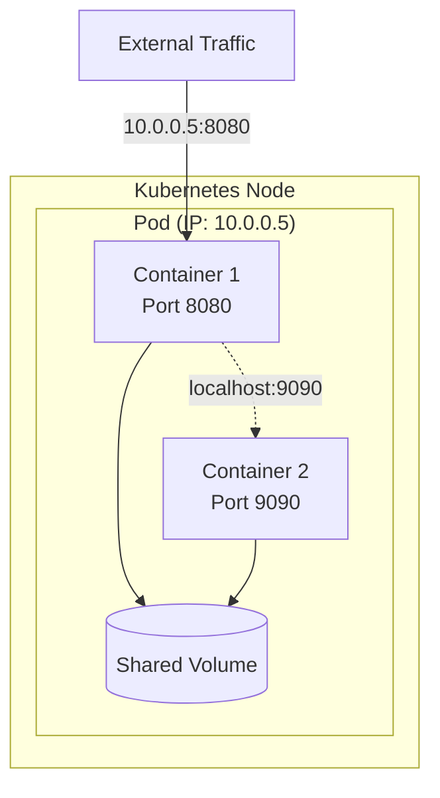

> **📚 Interactive Documentation**
> 
> This document was created using the **learning** skill. For the best learning experience:
> 1. Read through the document first
> 2. Return to Cursor chat and answer the Q&A questions
> 3. Ask questions if something is unclear — the document will be updated!
> 
> To modify or improve this document, use: `@.cursor/skills/learning/SKILL.md`

# Example: Kubernetes Pods

> **TL;DR**: A Pod is the smallest deployable unit in Kubernetes - it's a wrapper around one or more containers that share storage and network.

## Overview

A **Pod** is the basic building block of Kubernetes. Think of it as a "logical host" for your containers. While you might be used to thinking about individual containers (like Docker containers), Kubernetes thinks in terms of Pods.

Why not just use containers directly? Because sometimes your application needs multiple containers that work closely together - sharing files, communicating over localhost, or starting/stopping together. A Pod groups these containers as a single unit.

Most of the time, you'll have one container per Pod. But understanding that Pods *can* have multiple containers helps you understand why Kubernetes uses this abstraction.

## Why It Matters

As a developer, you'll interact with Pods constantly:

- **Debugging**: When something goes wrong, you'll check Pod logs and status
- **Deployments**: Your code runs inside Pods
- **Scaling**: Kubernetes creates/destroys Pods to handle load

## Key Concepts

### Containers Inside Pods

A Pod wraps one or more containers. These containers share:
- **Network**: They can talk to each other via `localhost`
- **Storage**: They can share volumes (directories)
- **Lifecycle**: They start and stop together

> 💡 **Think of it like**: A Pod is an apartment, and containers are roommates. They share the same address (IP), kitchen (storage), and lease (lifecycle).

### Pod Lifecycle

Pods go through several phases:

| Phase | Meaning |
|-------|---------|
| Pending | Pod accepted, but containers not running yet |
| Running | At least one container is running |
| Succeeded | All containers finished successfully |
| Failed | At least one container failed |
| Unknown | Can't determine state (usually network issues) |

### Pod IP Address

Every Pod gets its own IP address. Containers in the same Pod share this IP but use different ports.

> 💡 **Think of it like**: The Pod IP is your apartment's address. Each container (roommate) has their own room number (port).

## How It Works



**What this shows:**
1. Both containers live in the same Pod
2. They share an IP address (10.0.0.5)
3. They can communicate via localhost
4. They can both access the shared volume

## Practical Examples

### Example 1: Simple Single-Container Pod

```yaml
# my-app-pod.yaml
apiVersion: v1
kind: Pod
metadata:
  name: my-app           # Name of your Pod
  labels:
    app: my-app          # Labels for organizing/selecting
spec:
  containers:
    - name: app          # Container name (for logs, exec)
      image: nginx:1.21  # Docker image to run
      ports:
        - containerPort: 80  # Port the container listens on
```

**What's happening here:**
1. We create a Pod named `my-app`
2. It has one container running nginx
3. The container exposes port 80

**To apply this:**
```bash
kubectl apply -f my-app-pod.yaml
kubectl get pods  # Check status
kubectl logs my-app  # View logs
```

### Example 2: Pod with Sidecar Container

```yaml
# app-with-logging.yaml
apiVersion: v1
kind: Pod
metadata:
  name: app-with-logging
spec:
  containers:
    # Main application
    - name: app
      image: my-app:v1
      volumeMounts:
        - name: logs
          mountPath: /var/log/app
    
    # Sidecar: ships logs to external service
    - name: log-shipper
      image: fluentd:v1
      volumeMounts:
        - name: logs
          mountPath: /var/log/app
          readOnly: true
  
  volumes:
    - name: logs
      emptyDir: {}  # Temporary storage shared between containers
```

**Key differences from Example 1:**
- Two containers in one Pod
- Shared volume (`logs`) between them
- Sidecar pattern: main app writes logs, helper ships them

## Common Pitfalls

> ⚠️ **Pitfall 1**: Creating Pods directly instead of using Deployments
> 
> **How to avoid**: Always use a Deployment or other controller. Naked Pods won't be rescheduled if a node fails.

> ⚠️ **Pitfall 2**: Putting unrelated containers in the same Pod
> 
> **How to avoid**: Only group containers that MUST share resources. Your web app and database should be separate Pods.

> ⚠️ **Pitfall 3**: Ignoring resource limits
> 
> **How to avoid**: Always set `resources.requests` and `resources.limits` to prevent one Pod from starving others.

## FAQ

### Q: When should I put multiple containers in one Pod?
**A**: Only when containers are tightly coupled and need to share resources. Common patterns:
- **Sidecar**: Helper container (logging, monitoring)
- **Ambassador**: Proxy for external services
- **Adapter**: Transform data formats

If containers can run independently, use separate Pods.

### Q: What happens when a Pod crashes?
**A**: It depends on who created the Pod:
- **Naked Pod**: Gone forever, not rescheduled
- **Deployment/ReplicaSet**: Kubernetes creates a new Pod automatically

This is why you should always use Deployments.

### Q: How do I debug a running Pod?
**A**: Common commands:
```bash
kubectl logs <pod-name>           # View logs
kubectl logs <pod-name> -f        # Stream logs
kubectl exec -it <pod-name> -- sh # Shell into container
kubectl describe pod <pod-name>   # Detailed status
```

### Q: Can Pods communicate with each other?
**A**: Yes! Every Pod gets an IP address. Pods can communicate directly via IP, but it's better to use **Services** which provide stable DNS names and load balancing.

## External Resources

### Official Documentation
- [Kubernetes Pods](https://kubernetes.io/docs/concepts/workloads/pods/) - Complete Pod reference
- [Pod Lifecycle](https://kubernetes.io/docs/concepts/workloads/pods/pod-lifecycle/) - Detailed lifecycle explanation

### Tutorials & Guides
- [Kubernetes Basics - Pods](https://kubernetes.io/docs/tutorials/kubernetes-basics/explore/explore-intro/) - Interactive tutorial
- [Multi-container Pods](https://kubernetes.io/docs/concepts/workloads/pods/#how-pods-manage-multiple-containers) - Sidecar patterns

### Tools
- [kubectl Cheat Sheet](https://kubernetes.io/docs/reference/kubectl/cheatsheet/) - Essential commands
- [Lens](https://k8slens.dev/) - Kubernetes IDE for visual Pod management

## Glossary

| Term | Definition |
|------|------------|
| **Pod** | The smallest deployable unit in Kubernetes, wrapping one or more containers |
| **Container** | A lightweight, standalone executable package that includes code, runtime, and dependencies |
| **Sidecar** | A helper container that runs alongside the main application container in the same Pod |
| **Volume** | Storage that can be shared between containers in a Pod |
| **Node** | A worker machine in Kubernetes that runs Pods |
| **Deployment** | A Kubernetes resource that manages Pod replicas and updates |
| **ReplicaSet** | Ensures a specified number of Pod replicas are running at any time |
| **Labels** | Key-value pairs attached to objects for identification and selection |
| **kubectl** | Command-line tool for interacting with Kubernetes clusters |

---

*Last updated: February 2026*
*This is an example document created by the learning skill*
