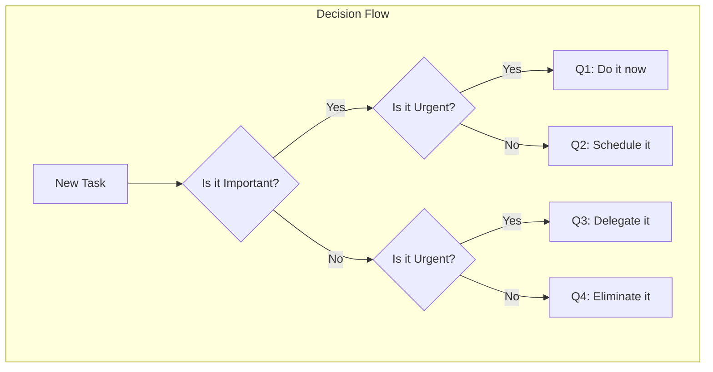

> **📚 Interactive Documentation**
> 
> This document was created using the **learning** skill. For the best learning experience:
> 1. Read through the document first
> 2. Return to Cursor chat and answer the Q&A questions
> 3. Ask questions if something is unclear — the document will be updated!
> 
> To modify or improve this document, use: `@.cursor/skills/learning/SKILL.md`

# Example: The Eisenhower Matrix

> **TL;DR**: The Eisenhower Matrix is a time management tool that helps you prioritize tasks by sorting them into four quadrants based on urgency and importance.

## Overview

The **Eisenhower Matrix** (also called the Urgent-Important Matrix) is a simple but powerful framework for deciding what to work on. Named after President Dwight D. Eisenhower, who was famous for his productivity, it helps you stop reacting to whatever feels urgent and start focusing on what actually matters.

The core idea is that urgency and importance are not the same thing. Urgent tasks demand immediate attention (a ringing phone, a deadline today), while important tasks contribute to your long-term goals and values. The problem? Urgent tasks often feel important even when they're not, leading us to spend our days putting out fires instead of making real progress.

By categorizing every task into one of four quadrants, you can make better decisions about where to spend your time and energy.

## Why It Matters

Understanding this framework can transform how you work:

- **Reduced stress**: Stop feeling overwhelmed by knowing exactly what deserves your attention
- **Better results**: Focus energy on high-impact activities instead of busywork
- **Clearer boundaries**: Learn to say no to tasks that don't serve your goals

## Key Concepts

### Urgent vs. Important

These two qualities are often confused but are fundamentally different:

- **Urgent**: Requires immediate attention. Has a deadline. Creates pressure.
- **Important**: Contributes to your mission, values, and long-term goals.

> 💡 **Think of it like**: Urgent is someone knocking on your door right now. Important is whether you actually want to let them in.

### The Four Quadrants

The matrix divides all tasks into four categories based on these two dimensions:

| Quadrant | Urgent? | Important? | Action |
|----------|---------|------------|--------|
| Q1: Do | Yes | Yes | Handle immediately |
| Q2: Schedule | No | Yes | Plan time for these |
| Q3: Delegate | Yes | No | Give to someone else |
| Q4: Eliminate | No | No | Stop doing these |

> 💡 **Think of it like**: Q1 is a fire you must put out. Q2 is fire prevention. Q3 is someone else's fire. Q4 is watching fire videos on YouTube.

### The Q2 Principle

The most productive people spend most of their time in **Quadrant 2** — important but not urgent tasks. These are things like:

- Strategic planning
- Relationship building
- Learning and skill development
- Health and exercise
- Prevention and preparation

> 💡 **Think of it like**: Q2 is like maintaining your car. It's never urgent until you skip it — then everything becomes urgent.

## How It Works

```mermaid
quadrantChart
    title Eisenhower Matrix
    x-axis Low Urgency --> High Urgency
    y-axis Low Importance --> High Importance
    quadrant-1 Q1: DO
    quadrant-2 Q2: SCHEDULE
    quadrant-3 Q4: ELIMINATE
    quadrant-4 Q3: DELEGATE
```



**What this shows:**
1. Every task gets evaluated on two dimensions
2. The answer determines which quadrant it belongs to
3. Each quadrant has a clear action associated with it

## Practical Examples

### Example 1: A Typical Workday

Let's sort some common tasks:

**Quadrant 1 (Do)** — Urgent AND Important:
- Client presentation due today
- Server is down and customers can't access the service
- Medical emergency

**Quadrant 2 (Schedule)** — Important but NOT Urgent:
- Planning next quarter's strategy
- Building relationships with key stakeholders
- Learning a new skill for career growth
- Regular exercise

**Quadrant 3 (Delegate)** — Urgent but NOT Important:
- Most phone calls and emails
- Someone else's deadline that got pushed to you
- Interruptions from colleagues on non-critical matters

**Quadrant 4 (Eliminate)** — Neither Urgent nor Important:
- Mindless social media scrolling
- Unnecessary meetings with no clear purpose
- Busy work that doesn't contribute to goals

### Example 2: Applying the Matrix to Email

Here's how to process your inbox using the matrix:

| Email Type | Quadrant | Action |
|------------|----------|--------|
| Boss needs answer for board meeting today | Q1 | Reply immediately |
| Colleague wants feedback on proposal (due next week) | Q2 | Schedule 30 min tomorrow |
| Newsletter you subscribed to | Q4 | Unsubscribe or delete |
| Request to join optional committee | Q3 | Politely decline or delegate |

**Key insight:** Most emails feel urgent but aren't important. The inbox creates false urgency.

## Common Pitfalls

> ⚠️ **Pitfall 1**: Treating everything as Q1 (urgent and important)
> 
> **How to avoid**: Ask yourself: "What happens if I don't do this today?" If the answer is "nothing much," it's not Q1.

> ⚠️ **Pitfall 2**: Neglecting Q2 until it becomes Q1
> 
> **How to avoid**: Block dedicated time for Q2 activities. Treat these appointments as non-negotiable.

> ⚠️ **Pitfall 3**: Feeling guilty about Q4 elimination
> 
> **How to avoid**: Remember that saying no to unimportant things means saying yes to what matters. Your time is finite.

## FAQ

### Q: How do I know if something is truly important?
**A**: Ask yourself: "Does this contribute to my long-term goals, values, or responsibilities?" If you removed this task entirely, would it impact your mission? Important tasks align with your core objectives, not just immediate demands.

### Q: What if my boss assigns me Q3 tasks?
**A**: First, clarify expectations — sometimes what seems unimportant to you is important to them. If it's genuinely Q3, discuss priorities: "I can do X, but it means Y won't get done. Which is more important?" This opens a conversation about delegation or reprioritization.

### Q: How often should I review my matrix?
**A**: Daily for task sorting (5 minutes in the morning), weekly for pattern review (are you spending too much time in Q3?), and monthly for strategic adjustment (are your Q2 activities aligned with your goals?).

### Q: What if everything feels urgent?
**A**: This usually means you're in reactive mode. Step back and ask: "Urgent according to whom?" Often, urgency is imposed by others or by poor planning. Start protecting Q2 time, and you'll have fewer Q1 emergencies over time.

## Glossary

| Term | Definition |
|------|------------|
| **Urgent** | Requiring immediate attention; time-sensitive with near-term deadlines |
| **Important** | Contributing to long-term goals, values, mission, or core responsibilities |
| **Quadrant 1** | Tasks that are both urgent and important — crises and deadlines |
| **Quadrant 2** | Tasks that are important but not urgent — planning, prevention, growth |
| **Quadrant 3** | Tasks that are urgent but not important — interruptions, others' priorities |
| **Quadrant 4** | Tasks that are neither urgent nor important — time wasters, busywork |
| **Time blocking** | Scheduling specific time periods for specific types of work |
| **Delegation** | Assigning tasks to others who can handle them appropriately |

## External Resources

### Books
- [The 7 Habits of Highly Effective People](https://www.franklincovey.com/the-7-habits/) - Stephen Covey's classic that popularized the matrix
- [Essentialism](https://gregmckeown.com/books/essentialism/) - Greg McKeown on the disciplined pursuit of less

### Articles & Guides
- [Eisenhower.me](https://www.eisenhower.me/eisenhower-matrix/) - Dedicated resource for the matrix
- [James Clear on the Eisenhower Box](https://jamesclear.com/eisenhower-box) - Practical application guide

### Tools
- [Todoist Eisenhower Matrix](https://todoist.com/productivity-methods/eisenhower-matrix) - Digital implementation
- [Notion Templates](https://www.notion.so/templates/eisenhower-matrix) - Ready-to-use matrix templates

---

*Last updated: March 2026*
*This is an example document created by the learning skill*
