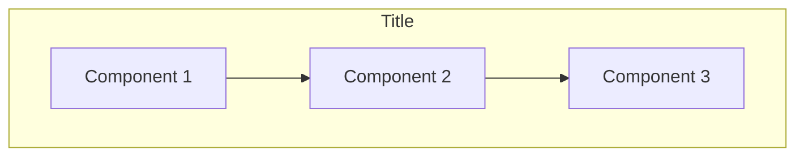

> **📚 Interactive Documentation**
> 
> This document was created using the **learning** skill. For the best learning experience:
> 1. Read through the document first
> 2. Return to Cursor chat and answer the Q&A questions
> 3. Ask questions if something is unclear — the document will be updated!
> 
> To modify or improve this document, use: `@.cursor/skills/learning/SKILL.md`

# [Topic Title]

> **TL;DR**: [One sentence summary of what this is and why it matters]

## Overview

[2-3 paragraphs explaining what this topic is in plain language. Avoid jargon. Use analogies.]

## Why It Matters

[Explain why a developer should care about this. How does it affect their daily work?]

- **Benefit 1**: [Description]
- **Benefit 2**: [Description]
- **Benefit 3**: [Description]

## Key Concepts

### [Concept 1]

[Explanation with analogy]

> 💡 **Think of it like**: [Real-world analogy]

### [Concept 2]

[Explanation with analogy]

### [Concept 3]

[Explanation with analogy]

## How It Works



[Explanation of the diagram]

## Practical Examples

### Example 1: [Basic Use Case]

```yaml
# Description of what this config does
apiVersion: v1
kind: [Resource]
metadata:
  name: example
spec:
  # Key configuration explained
  key: value
```

**What's happening here:**
1. [Explanation of line/section 1]
2. [Explanation of line/section 2]
3. [Explanation of line/section 3]

### Example 2: [More Advanced Use Case]

```yaml
# More complex example
```

**Key differences from Example 1:**
- [Difference 1]
- [Difference 2]

## Common Pitfalls

> ⚠️ **Pitfall 1**: [Description]
> 
> **How to avoid**: [Solution]

> ⚠️ **Pitfall 2**: [Description]
> 
> **How to avoid**: [Solution]

> ⚠️ **Pitfall 3**: [Description]
> 
> **How to avoid**: [Solution]

## FAQ

<!-- This section is populated after the Q&A session -->

### Q: [Question 1]
**A**: [Answer]

### Q: [Question 2]
**A**: [Answer]

### Q: [Question 3]
**A**: [Answer]

## Glossary

| Term | Definition |
|------|------------|
| **[Term 1]** | [Definition] |
| **[Term 2]** | [Definition] |
| **[Term 3]** | [Definition] |

## External Resources

### Official Documentation
- [Resource Name](URL) - Brief description of what you'll find

### Tutorials & Guides
- [Tutorial Name](URL) - Brief description

### Tools
- [Tool Name](URL) - What it helps with

---

*Last updated: [Date]*
*Author: [Name/Team]*
